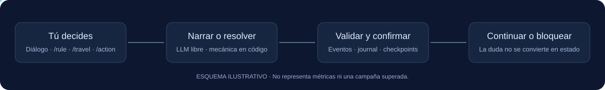

<div align="center">



**Un director de juego local. Tu imaginación al mando. El código conserva las reglas.**

[Instalar](INSTALL.md) · [Instalación por un agente IA](AGENT_INSTALL.md) · [Estado Alpha](ALPHA_STATUS.md) · [Contribuir](CONTRIBUTING.md)


[](LICENSE)

</div>

> [!WARNING]
> Alpha experimental para partidas desechables y uso supervisado. La narración puede cometer errores y la compactación puede bloquear una sesión. No fuerces su aceptación ni uses partidas irremplazables. [Limitaciones](ALPHA_STATUS.md).

## Una mesa de rol, sin enviar tu campaña a una API de nube

**RolerIA llm**, desarrollado como Nyx RPG, combina conversación en español con un núcleo de juego determinista. El modelo da voz a la escena; las tiradas, la salud, el inventario y los cambios confirmados pertenecen al código.

Interfaz inicial **CLI/TUI**, no una web ni un servicio público. La inferencia se ejecuta localmente mediante llama.cpp.



## Qué puedes probar

| Tú haces | RolerIA hace | Límite |
|---|---|---|
| Conversar | Genera narración libre en español | El diálogo no modifica PG, inventario ni ubicación |
| `/rule movement.difficult_terrain ¿Cuánto cuesta avanzar?` | Consulta una fuente registrada | Sin fuente suficiente, bloquea |
| `/travel inn-to-bridge` | Confirma un viaje registrado | Necesita configuración y tokenizador |
| `/action rival-attack` | Tira dados por código y aplica daño real | Combate mínimo, sin IA táctica |
| `/action training-attack` | Calcula entrenamiento | No resta PG |
| Guardar, verificar y reabrir | Usa eventos y checkpoints | No acepta una memoria dudosa |

Los comandos de ejemplo requieren preparar primero la campaña inicial. No hay parser universal de acciones ni automatización completa de todas las reglas.

## Empezar

```powershell
git clone https://github.com/Ghenwy/RolerIA-llm.git
Set-Location RolerIA-llm/DDRolLocal
npm ci
npm run build
npm run smoke:cli
node dist/apps/tui/src/main.js --help
```

Esto compila el código. **Modelo, binarios y configuración de máquina se preparan por separado**, según [INSTALL.md](INSTALL.md). La plantilla distribuida no es una configuración lista para arrancar.

Con el runtime local configurado y verificado:

```powershell
node dist/apps/tui/src/main.js runtime start
node dist/bootstrap/prepare-beta.js CAMPAIGN-alpha-01
node dist/apps/tui/src/main.js play CAMPAIGN-alpha-01
node dist/apps/tui/src/main.js save CAMPAIGN-alpha-01
node dist/apps/tui/src/main.js runtime stop
```

Usa un ID nuevo al preparar una campaña. No sobrescribas una existente.

### Configuración de llama.cpp.

[INSTALL](INSTALL.md) explica compilación y preparación; [installer.md](installer.md) enlaza esa guía.

El launcher configura slots, contexto, caché KV, atención, lotes y endpoint desde un archivo **local e ignorado por Git**. No se incluyen perfiles reales del mantenedor ni fingerprints de su equipo. La plantilla explica los campos; cada instalación valida sus propios archivos y capacidades.

No se distribuyen EXE, DLL ni pesos. Usa sólo loopback (`127.0.0.1`), nunca una interfaz pública.

## Qué protege el núcleo

- Dados calculados por código y estado confirmado mediante transacciones.
- JSON/JSONL local, replay y transcript conservado.
- Contexto público filtrado y separación de secretos.
- Compactación que bloquea ante validación fallida.
- Recuperación degradada en Python, con bloqueo de operaciones no soportadas.

Estas garantías de diseño no convierten la narración del modelo en una fuente mecánica ni garantizan ausencia de alucinaciones.

<details>
<summary><strong>Arquitectura</strong></summary>

```text
DDRolLocal/
├── apps/tui/           CLI / TUI
├── bootstrap/          composición local
├── packages/           núcleo, contratos, persistencia, LLM y reglas
├── fallback/python/    recuperación degradada
├── scripts/runtime/    arranque y preflight
└── tooling/            build y generación de contratos
```

TypeScript, npm workspaces, contratos JSON Schema y fallback Python. Las configuraciones de compilación son genéricas; la configuración de ejecución pertenece a cada instalación.

</details>

## Desarrollo y privacidad

`npm run check:source` comprueba tipos, build y ayuda CLI. No ejecuta una campaña física ni sustituye pruebas de comportamiento.

Este repositorio distribuye código, contratos necesarios y documentación pública. **Pruebas internas, experimentos, investigación, planificación y configuraciones reales no forman parte de la distribución.**

Consulta [CONTRIBUTING.md](CONTRIBUTING.md). No adjuntes campañas, datos personales, prompts privados, credenciales o logs sin revisar. [Seguridad](SECURITY.md).

## Licencia y atribución

**[MIT para el código propio](LICENSE)** · Copyright (c) 2026 Nyx RPG contributors.

Los datos reglamentarios y terceros conservan sus condiciones: [THIRD_PARTY_NOTICES.md](THIRD_PARTY_NOTICES.md) y [licencia SRD](docs/legal/SRD-3.5-LICENSE.md). No hay afiliación ni respaldo oficial de titulares de modelos o sistemas de juego.

---

<div align="center">

**Imaginación local. Autoridad explícita.**

[Comenzar la instalación](INSTALL.md) · [Dar el encargo a un agente](AGENT_INSTALL.md)

</div>
